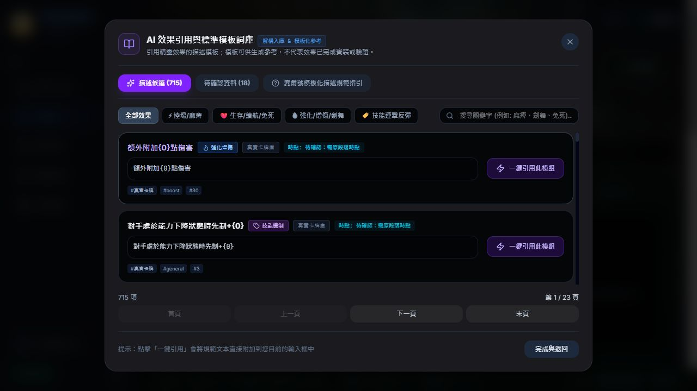
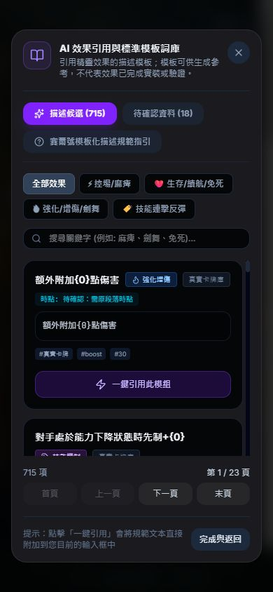
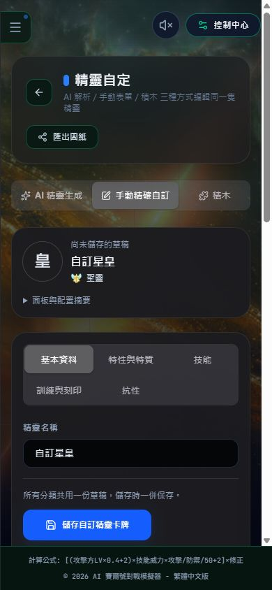

# UI 第三階段：草稿完整性、頁面恢復與效果庫驗收

日期：2026-10-01。延續前兩階段，依實際程式、測試及畫面確認；本階段不修改技能結算、魂印或兩個特殊模式的邏輯。

## 實際發現與修正

| 問題 | 修正與邊界 | 檔案 |
| --- | --- | --- |
| 舊頁面請求已更換的分頁資源，返回首頁不一定能恢復 | 分辨資源載入錯誤，提供確認後的整頁重新載入；提醒未儲存草稿／對戰進度會失去，不自動刷新或清存檔 | `src/components/PageErrorBoundary.tsx` |
| 載入動畫顯示假的進度、記憶體及安全檢查 | 換成單一輕量載入提示，尊重減少動畫設定，不模擬進度 | `src/components/TechLoadingScreen.tsx` |
| 匯出圖紙缺少完整手動資料 | 匯出 schemaVersion 2 的 `manualElf`，和儲存共用完整資料組裝；保留舊匯出欄位，新建草稿 ID 固定。尚未建立新版匯入介面 | `src/components/ElfEditor.tsx` |
| 只有 exclusiveTraits 陣列時，儲存可能整組遺失 | 即使沒有主要專屬特質，也保留其餘專屬特質陣列；尚未提供多項特質管理 UI | `src/components/ElfEditor.tsx` |
| 抗性欄仍顯示麻痹、缺少魘味 | 名稱使用異常登記表顯示為麻痺，保留舊選項 key 與存檔值；加入弱化類魘味選項。未變更戰鬥中的歷史別名匹配邏輯 | `src/components/ResistancePanel.tsx` |
| 桌面效果庫左側被側欄蓋住 | 原本視窗在主頁的堆疊層內，提高局部 z-index 仍無法超越側欄；改用 body portal。補 Escape、焦點循環／還原及引用提示計時器清理 | `src/components/EffectLibraryModal.tsx` |
| 規範宣稱 100% 可用、自動與引擎相容 | 改成可核對的描述，不把模板存在等同實裝。分號不保證解析，也不決定戰鬥結算優先級 | `src/data/cardTemplates.ts`、`src/components/EffectLibraryModal.tsx` |

本階段沒有刪除或改寫 733 筆模板的原始內容／ID。715 筆仍是描述候選，不等於可執行效果；18 筆標題／背景／待確認資料仍禁止引用。語意有疑慮應回到 elf_files／elf_source_files 的 TXT 核對，不能猜測或修改文本遷就引擎。

## 驗證結果

- `npm run lint`：通過。
- `npm test`：完整指令通過，包含既有戰鬥、積木、雷伊、聖靈邁爾斯、朝向、載入、資料與作用域測試，以及生成檔／覆蓋率檢查。
- UI 測試：46 項通過（基礎 24、編輯 16、頁面恢復 6），本階段新增 13 項。測試檔：`tests/elfEditorLayout.semantic.test.ts`、`tests/pageRecovery.semantic.test.ts`；`package.json` 已串入正式測試流程。
- 草稿測試實際修改、匯出、儲存 callback、重新開啟，核對身高體重、個體值、抗性、專屬特質、技能庫與正式重算面板；沒有寫入使用者真實存檔。
- 效果庫單元測試連續 8 次開關，驗證 portal、焦點還原、鍵盤監聽清理、單一視窗與有界卡片數。
- `npm run build`：成功，首頁主 JS 489.59 kB（gzip 121.06 kB），首頁靜態 JS 合計 1023.69 kB；`npm run audit:bundle` 通過。
- **Blockly 715.42 kB 的大型區塊警告仍存在**。已延遲載入，未調高警告門檻；不能宣稱所有大型區塊已消除或不卡頓。

驗證期間曾出現焦點測試失敗：測試 DOM 的複合選擇器將輸入框排到按鈕後方，焦點循環未按畫面順序執行。另因斷言展開整個 DOM 物件，出現記憶體配置錯誤。已明確排序焦點節點，改用簡短布林斷言，保留失敗歷程並重跑完整測試通過；沒有略過測試。

## 實際瀏覽器驗收

使用獨立 3001 正式版測試服務，不關閉使用者的 3000 服務。不儲存精靈、刪除資料或動特殊模式。測完關閉測試分頁、還原尺寸並停止本階段測試服務。

1. 桌面 1280×720：效果庫直接掛在 body，位於側欄上方；關閉按鈕取得焦點，原本被遮住的標題、卡片及分頁均可看到。
2. 手機 390×844：效果庫寬 358 px、左右留 16 px，整頁 scrollWidth = clientWidth = 390，無橫向溢出。手動編輯五類切換時也未觀察到橫向溢出；摘要預設收合。
3. 末頁為 23／23；搜尋麻痺得到 10 筆、1／1 頁。
4. 待確認分類 18 筆均禁用，Escape 可關閉視窗。
5. 實際瀏覽器連續 20 次關閉／重開，其中 10 次包含下一頁操作；關閉後無殘留視窗，重開只顯示 32 張候選卡片，未重現先前畫面讀取逾時。
6. 抗性選單只顯示一個麻痺選項，實際舊值仍是麻痹；魘味選項存在。最後測試分頁沒有捕捉到 console error。

先前舊分頁曾請求舊的 ElfEditor 資源，另觀察到測試服務停止時連線失敗，以及一次效果庫畫面讀取逾時。這些是不同觀察，**不足以將所有卡死定案為單一原因**；本輪穩定版重測可操作，不代表已涵蓋所有頁面與低階裝置。

### 截圖

## 下一階段仍須處理

1. AI 頁內部雙欄仍是舊版；應改成輸入／解析／預覽分類，保留全文本本地解析與既有工作流程。手機上方標題、模式切換及摘要仍佔較多垂直空間，尚可再收斂。
2. 多項專屬特質的新增、編輯、排序與刪除管理；目前僅保留原陣列，不提供完整管理。
3. 新版完整草稿匯入、格式校驗、版本相容與取消匯入測試；目前只完成匯出／儲存一致性。
4. 異常分類與歷史別名在引擎中的匹配需逐條核對；這輪只修顯示及魘味選項，不將 UI 修正算成抗性結算修正。
5. 效果資料庫、百科後段、刻印／技能替換與 Blockly 工作區逐頁驗收；20 次開關僅針對效果引用庫，未涵蓋所有彈窗。
6. 正式長任務、FPS、記憶體及低階手機效能測量尚未完成。先前卡片限制、按需載入及本輪單動畫是降低負擔的措施，不是絕對流暢保證。
7. Blockly 核心大區塊仍待相容性審查，不能直接硬拆內部模組消警告。
8. 效果語意覆蓋仍未完成：本次稽核為技能 483／757、魂印 104／431、合計 587／1188（49.4%）；明確積木執行仍為 31 技能、6 魂印。**描述解析率不等於戰鬥實裝率或正確率。**

## Git 範圍

開始時 main 與 origin/main 的本機追蹤一致、工作樹乾淨；未對遠端執行 fetch，所以不以此保證 GitHub 當下無新提交。本階段僅納入上列 UI／測試檔案與此報告、截圖。沒有修改戰鬥核心或推送 GitHub。
