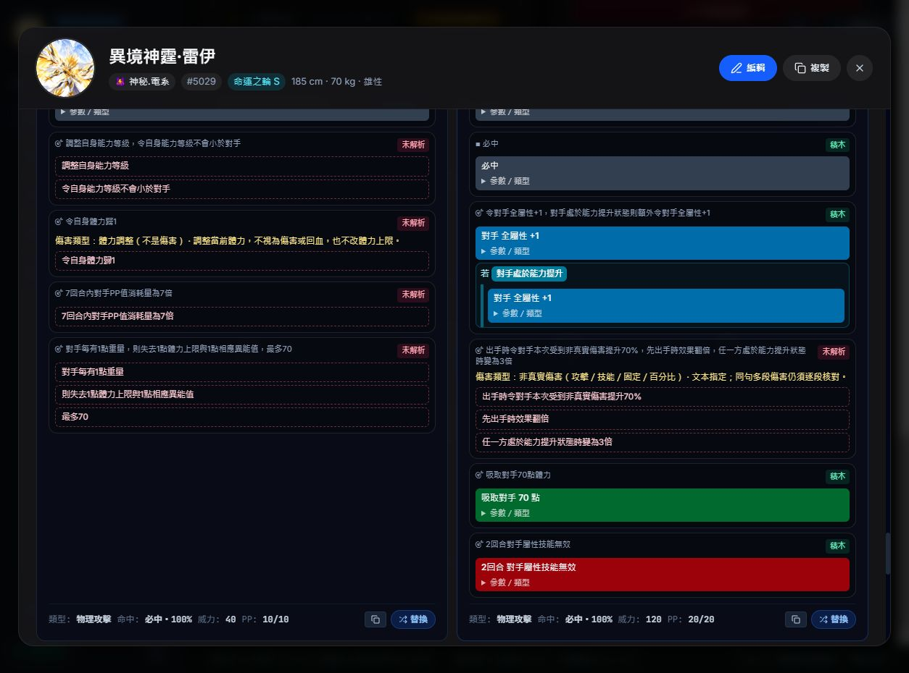
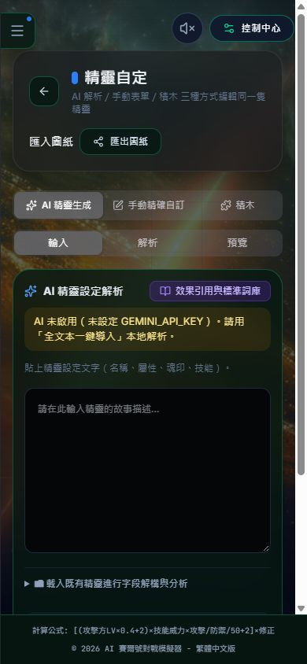

# 第四階段：效果明確化、草稿與積木核對

日期：2026-10-01。只描述本輪實際修改與驗證；未推送 GitHub，未改特殊模式玩法。

## 八項要求的實際狀態

| 項目 | 本輪成果 | 未完成／限制 |
|---|---|---|
| AI 編輯分類 | 改輸入／解析／預覽，只有當前面板掛載；全文本本地解析、編輯與保存流程保留；手機標題與輸入區收斂 | 未呼叫付費／遠端 AI 驗收；不能用本地解析測試證明遠端生成正確 |
| 多專屬特質 | 新增、名稱／描述編輯、上下排序、確認刪除、取消刪除；未編輯的機制欄位保留 | 手寫程式對新特質的執行不是本次表單操作能自動產生的 |
| 完整圖紙匯入 | v2 完整草稿、v1 舊格式提示、未來版本拒絕；預覽確認／取消；編輯時維持原精靈 ID，不讓檔案 ID 覆寫另一隻 | 有大小、深度、數值、結構與原型鍵校驗，但尚非所有巢狀機制參數的完整語意校驗；瀏覽器真實檔案匯入仍須擴充驗收 |
| 異常名稱與分類 | 分類來自登記表，抗性／查詢／控免共用別名；混亂與束縛不再誤判為控制；麻痹與麻痺匹配 | 整套異常的扣回合、轉化、清除、死亡與場下節點仍需逐條引擎情境測試 |
| 後段頁面與彈窗 | 百科各類、效果庫首末頁、Blockly 單工作區與手機尺寸實測；刻印與技能替換庫各 20 次開關；刻印焦點／Escape／卸載測試；首頁詳情與替換庫移頂層，避開側欄與動畫容器 | 不是全部精靈／所有技能替換操作／所有彈窗情境的完整驗收；本輪不保存瀏覽器測試配裝 |
| 效能 | 手動 60 秒畫面回呼／長任務／可用 JS heap 量測；解析快取改有上限；Blockly 懶載入、ResizeObserver 與卸載清理 | 桌面量測不是 GPU FPS、整個程序記憶體或真實低階手機結果；長時間戰鬥與實體手機未驗收 |
| Blockly 大區塊 | 安全壓縮、只匯入公開 core 與 locale，未用未公開路徑硬拆；數值模式不載工作區 | **710.56 kB，gzip 190.52 kB，500 kB 警告仍在**；沒有提高警告門檻或外部 CDN 掩蓋 |
| 效果語意覆蓋 | 32 隻預設精靈的技能／魂印／特質均有唯讀積木對照；原句、條件、參數、未解析子句、執行來源保留；可匯出核對 JSON | **明確積木執行仍 31 技能、6 魂印；本輪沒有宣稱全精靈效果已正確實裝** |

## 傷害類型

新增傷害效果編輯器可選「固定、百分比、X 系技能、真實」，固定與百分比優先；數值單位與傷害類別分開，70% 取值的真實傷害仍走真實傷害管線。技能類必須指定屬性。

直接技能命中附加使用 attack_damage 節點，延遲效果使用 skill_effect；選技能傷害本身不會憑空建立額外行動。0% 不再被 `||` 兜底成 10 倍體力。未確認類別記錄待確認，不偷改成粉傷。

實際畫面驗收發現「非真實傷害」誤匹配「真實傷害」字串，已修為獨立範圍顯示（攻擊／技能／固定／百分比），並加入同句包含額外真傷的回歸測試。

尚需擴展：倍率／抵擋／反彈／吸取等原子也應採相同類別選擇；本輪選擇器針對新增直接傷害，不代表每種效果原子已全參數化。

## 石化與冰封：依使用者指定規則核對

- 石化：CONTROL、CANT_ACT，沒有衍化。
- 冰封：CONTROL、EVOLUTIONARY；結束時速度 −1，轉為 3 回合凍傷。
- `frostbite`：凍傷，不是冰封。
- 舊戰鬥代號 `frozen` 原本在狀態表代表石化。本輪保留它不衍化的意義，移除控免入口將其當冰封、資訊入口將其當凍傷的矛盾。
- `ice_sealed`、凍結、冰凍對應冰封；結構化效果輸入 `freeze` 是冰封、`frozen` 是石化。

新增測試確認定義、別名、分類、資訊顯示；這不等於所有舊存檔／全生命周期的狀態遷移已測完。

## 可追蹤的全精靈清單

`全精靈效果實裝核對.md` 與 `.json` 含 32 隻、1388 個非說明子句，範圍包括特質與預備技能，因此不能與原 1188 的分母直接比改善率。

每句先保留 semanticVerification=pending。已有 handler 只證明有執行入口；未解析也不能推論專屬程式完全沒有做。核對 JSON 不是可直接匯入戰鬥的 Kit。

原本解析基準未變：技能 483/757、魂印 104/431、合計 587/1188（49.4%）。要提升戰鬥積木執行登記，下一步必須以 TXT 逐句比對、建立實際節點測試，再改 mode，不能只看圖塊數量。

## 驗證與失敗紀錄

- 型別檢查通過。
- 完整測試套件通過；UI 53 項、效果明確化 15 項，另含原戰鬥、魂印、雷伊、聖靈邁爾斯、作用域、載入與資料回歸。
- 正式建置成功，保留 Blockly 警告；包大小回歸檢查通過。首頁靜態 JS 979.20 kB、主區塊 495.41 kB，並不是低階手機的載入時間保證。
- 傷害提示修正後核對 JSON 一度不一致，檢查正確拒絕；重新產生後通過，不把這個失敗藏掉。
- 建置更新 dist 時，舊瀏覽器嘗試載入舊雜湊模組失敗，恢復提示正常顯示；重新載入再驗收。需另處理正式部署的版本資源原子替換／舊資源保留策略。
- 瀏覽器刻印與替換庫開關沒有寫入配裝；不以未儲存的 UI 測試替代保存流程測試。

本輪安裝實際 Blockly 13.2.1、Vite 6.4.3。上一階段記錄為 Blockly 13.3.0／715.42 kB；鎖檔本來指定 13.2.1，本輪安裝 Terser 時套件目錄被重新對齊。**不能把前後約 5 kB 差異全歸功於壓縮器。**

## 效能量測（正式版，桌面）

| 操作 | 秒數 | 平均畫面回呼／秒 | >50ms 間隔 | 最長間隔 | 長任務 | 可用 JS heap |
|---|---:|---:|---:|---:|---:|---:|
| 靜置與少量頁面操作 | 60.0 | 59.9 | 0 | 49.9 ms | 0 | 16.3 MB |
| Blockly 範例與部分目標切換 | 60.0 | 59.8 | 2 | 99.9 ms | 1（最長109.0 ms） | 22.7 MB |

另完成 20 次技能／魂印目標切換，僅一個工作區，未提交的 Kit 保留；不能說全部 20 次都在量測區間內。390×844 視窗工作區約 341×480，頁面無橫向溢出；這是桌面窄視窗，不是實體手機。

新版 AI 頁在 390×844 下頁面寬與捲動寬均為 390，無橫向溢出；輸入／解析／預覽只保留一套分類。畫面證據：

## 實際修改檔案

新增：

- `src/effects/damageChoices.ts`、`statusAliases.ts`、`statusIdentity.ts`
- `src/blocks/audit.ts`、`scripts/audit_effect_implementation.ts`
- `src/utils/elfBlueprint.ts`、`boundedCache.ts`
- `src/components/DamageEffectComposer.tsx`、`EffectBlockToggle.tsx`、`ExclusiveTraitsEditor.tsx`、`BlueprintImportButton.tsx`、`PerformanceProbe.tsx`
- `tests/editorWorkflow.semantic.test.ts`、`effectClarity.semantic.test.ts`
- `docs/全精靈效果實裝核對.md`、`.json`、本報告與驗收截圖

修改：

- `src/components/ElfEditor.tsx`、`ElfEditorSections.tsx`、`InscriptionSystem.tsx`
- `src/components/KitEffectBuilder.tsx`、`BlocklyBuilder.tsx`、`ElfBlocklyPanel.tsx`
- `src/components/BlockProgramView.tsx`、`LazyBlockProgramView.tsx`、`EffectLibraryModal.tsx`
- `src/components/ElfReadOnlyProfile.tsx`、`ElfTraitCards.tsx`、`ResistancePanel.tsx`、`StatusInspector.tsx`、`StartScreen.tsx`、`ControlHub.tsx`
- `src/effects/effectRunner.ts`、`battleEventRegistry.ts`、`ailmentEngine.ts`、`genericSkillText.ts`
- `src/utils/battleHelpers.ts`、`statusManager.ts`、`traitsEngine.ts`、`src/blocks/registry.ts`
- `src/App.tsx`、`src/index.css`、`vite.config.ts`、`package.json`、`package-lock.json`
- `docs/UI統一與效能更新計畫_20261001.md`

## 下一批優先次序

1. 匯入巢狀機制／所有原子參數校驗與真正檔案匯入驗收，擴充直接傷害以外的選型欄位。
2. 狀態期限、衍化、下場、清除與 BOSS 規則逐條情境測試，避免只測分類。
3. 依核對清單與 TXT 逐隻補條件／成功失敗／傷害／場下語意，先驗證再移到積木執行。
4. 正式長時間戰鬥與實體低階手機量測；以長任務證據決定 Worker／分頁／批次化，不憑體感宣稱不卡的保證。
5. Blockly 單體公開核心是剩餘警告來源。若要真正低於 500 kB，需另做上游模組化構建或替代編輯器的相容性原型；既有工作區格式、拖曳、序列化、懶載入與存檔須全驗收後才替換。
