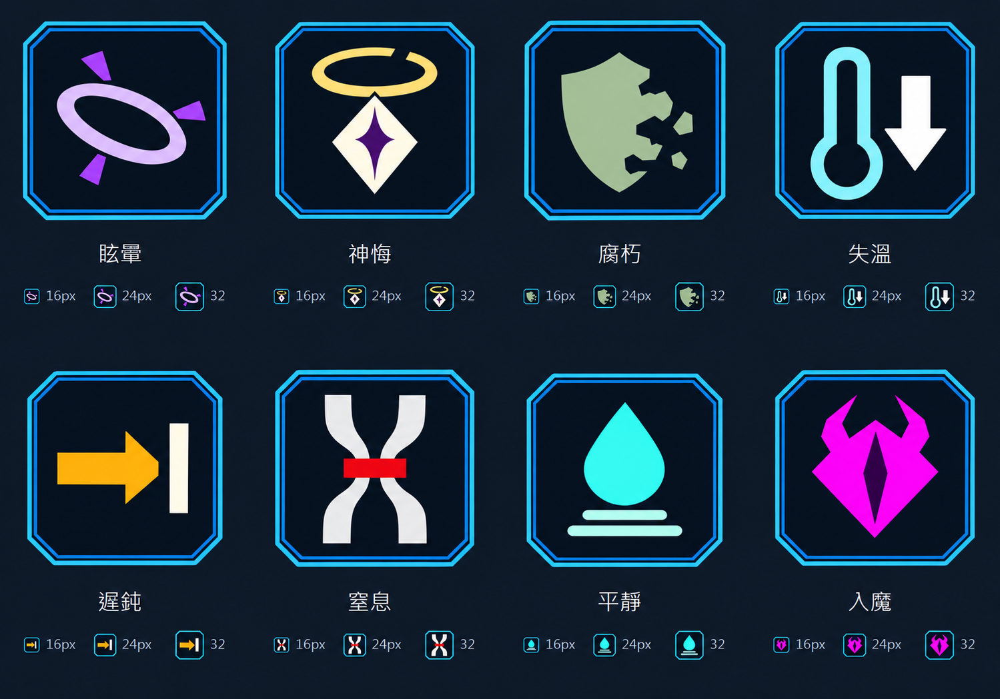

# 八種異常狀態圖標確認稿

2026-10-03，使用內建 imagegen 生成，各狀態各一張，另以圖像編輯清理確認總圖。尚未獲使用者確認；沒有修改 public 素材、圖標映射或戰鬥程式。

請以 **confirmation-clean.png** 的構圖、配色為確認依據。排列順序：

- 上排：眩暈、神悔、腐朽、失溫。
- 下排：遲鈍、窒息、平靜、入魔。

## 檔案與提示詞

- 八個中文命名 PNG 為首輪獨立生成原稿（1254×1254），未改寫原始生成檔；來源原圖仍留在 Codex generated_images。
- prompts.json 保留八張的共用及個別完整提示詞。
- confirmation-sheet.png 是將原稿並排與真正 16／24／32 px 縮圖排版的第一版圖。
- confirmation-clean.png 是對總圖做背景與边缘清理的圖像編輯結果，用於本輪確認；由於編輯工具重新輸出尺寸，**其中尺寸文字只作縮小效果示意，不能作嚴格 1:1 像素量測證據**。
- render-preview.ps1 只複製與排版原稿，未修改圖標本身。

## 總圖清理指令

只修復透明處理誤吃深色底造成的斑塊：各圖框內改為一致不透明深藍底，恢復腐朽盾形的灰綠實心填色，清理框外青色碎點。保留八種圖形、配色、切角框、四欄兩列順序、繁體中文標名與縮圖位置。整張確認圖為不透明深色底，不新增圖案、光效或文字，不重新設計。

## 確認後仍須處理

首輪單張原稿仍有透明遮罩误删內底／邊缘碎點，不能直接当作正式遊戲素材接入。使用者確認圖形後，需製作乾淨的獨立單張版本，統一實際外框尺度，輸出 256×256 PNG，保留框內不透明深底與框外透明角，再用真正 14／16／20／24／32 px 排版重新驗收。不得把總圖的標名或尺寸文字切進正式圖標。

本輪只供確認，沒有完成遊戲內接入、壓縮驗收或替換其他人已有素材。
