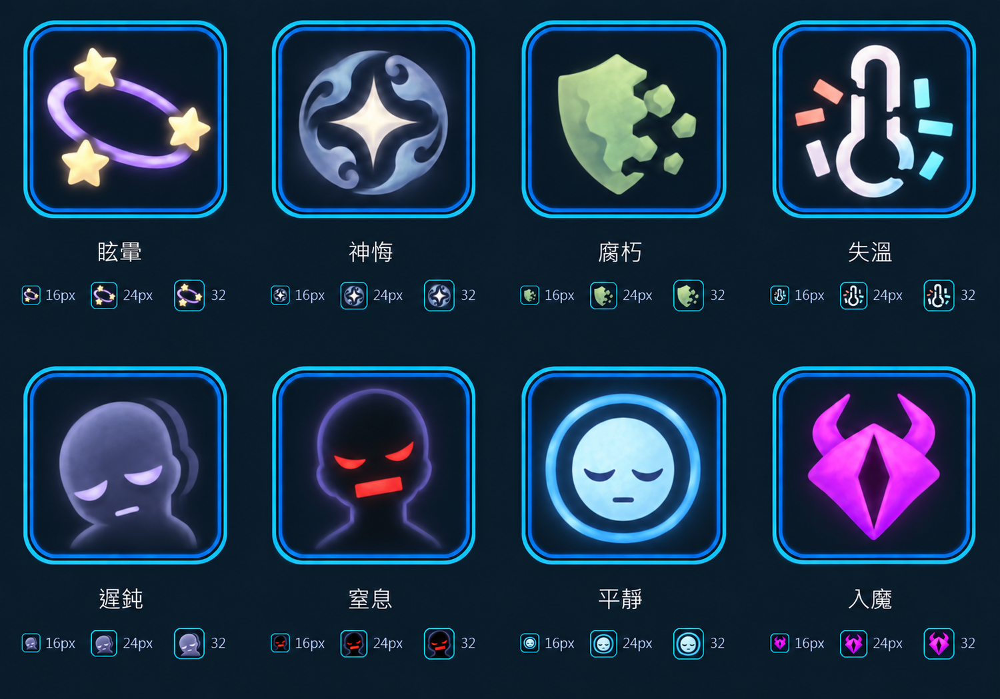

# 第三版異常圖標確認稿

使用內建 imagegen 編輯第二版確認稿。來源與提示詞保留，舊版不覆蓋，沒有修改遊戲內圖標或機制。

使用者要求與本版變更：

- 神悔：沿用第二版，已參考神遊 39 號圖，中央四角星加外圍灰藍圓形旋紋。
- 全組：沿用第二版的圓角框、柔化邊缘與簡單遊戲圖標筆觸。
- 眩暈：改為三顆金白星繞紫色圓軌道的經典意象。
- 失溫：不表示降溫，移除下降箭頭；以中性破裂溫度計、散落失序刻度與均衡冷暖片段表示溫度失去意義。這只是圖形意象，不更改現有狀態效果規則。
- 窒息：參考害怕 6 號與狂暴 14 號图；用黑影、緊縮紅眼與封閉口部表達呼吸受阻。
- 遲鈍：灰紫呆滯輪廓、沉重眼皮与延遲殘影，不再用箭頭。
- 平靜：淡藍閉眼面部與穩定柔和圓環，不再用水滴。
- 腐朽、入魔保持第二版意象。

此文件為構圖與風格確認圖，下方尺寸文字只是縮小示意，不是嚴格 1:1 像素驗收。尚未完成獨立單張的正式輸出、透明边界與精確尺寸驗收，也没有替換 public 素材或加入映射。
