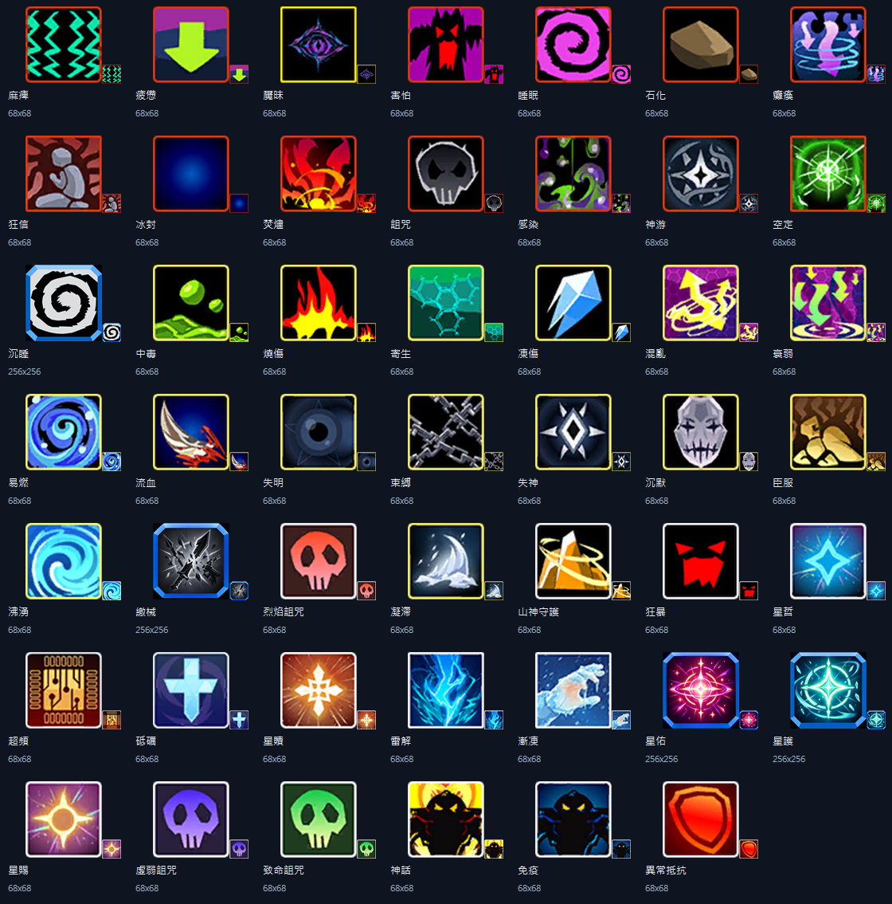

# 異常狀態圖標盤點與繪製準備

日期：2026-10-03。範圍：本機「對戰模擬器」現有工作樹。這次只盤點與籌備，不生成新圖、不替換舊素材、不修改戰鬥機制。

## 1. 盤點依據與結果

- 以 `src/effects/statusRegistry.ts` 的 `entry.name` 去重，再實際呼叫 `src/battle/effectIcons.ts` 的 `statusVisual()`，檢查其指向的本機 PNG。
- 58 個登記鍵，去除麻痹／麻痺、魘味／魘昧後，為 **56 種異常**。
- **48 種已映射且檔案存在：44 種使用遊戲來源素材、4 種使用使用者提供素材。**
- **8 種沒有映射，也沒有在 `異常圖標/`、`public/status-icons/` 找到對應名稱的 PNG。**另以名稱搜尋專案圖片，未找到同名 PNG/JPG/WebP/SVG 候選；不代表外部資源庫沒有圖片。
- `public/seer/abnormal/` 有 0–44 共 45 張 PNG；3 號「寄生對手」沒有作為獨立登記異常使用，不應因此新增一個缺圖項目。
- 護盾／護罩、魂殤、奧丁符文、異能值等印記／效果，不混入這個異常狀態分母。
- 本機 JSON 記錄素材來自 SeerAPI／遊戲資源；本次沒有重新連線搜尋外部 API，也沒有把本機資料當成官方最新效果定義。

機器可讀逐項資料：[inventory.json](status-artwork/inventory.json)。內容含名稱、别名、分類、現有描述、圖標路径、尺寸、PNG 格式及缺圖判斷。

48 張實際映射素材的對照圖，每格同時附 96 px 放大及 24 px 縮小預覽：

圖標存在不等於效果已實裝或正確；這份表不作戰鬥語意驗收證據。

## 2. 現有格式與視覺特色

### 共通結構

1. 正方形圖標，中心以單一符號為主，幾乎沒有文字，回合數不在圖片內。
2. 暗底配高明度圖形，外框清楚。多用剪影、箭頭、螺旋、骷髏、星形、冰晶、鎖鏈等抽象組合。
3. 顏色之外，還以形狀區分狀態：不能只靠「同一圖換色」做新狀態。
4. 圖形常有高對比硬邊；大面積形狀通常比細小紋理更耐縮小。

### 外框其實不是全部相同

| 組別 | 已核對格式 | 外框與底色 | 注意事項 |
|---|---|---|---|
| 遊戲來源 44 種 | 68×68，8-bit RGBA PNG | 大多細線方框、略圓角；常見控制紅橙框、弱化黃框、附屬白／灰框，但有例外 | 外框已畫在素材裡；不能再套一個同樣厚的圖片框 |
| 沉睡、星佑、星護、繳械 | 256×256，8-bit RGB PNG，沒有獨立 alpha 通道 | 較厚青藍切角／斜角框；深底；星佑／星護含較多光效 | 四張並非透明底圖，外側底色可能在透明 UI 上露出方塊；本次不去背 |
| UI 徽章 | 目前 `StatusBadgePanel.tsx` 繪圖區為 14×14 CSS px | 外層還有分類色、細邊框與文字 | 新圖應測 14／16／20／24 px；製作大圖不能解決顯示區過小 |

因此「統一」建議是：**新補的八張沿用使用者素材的青藍切角框，統一構圖、安全邊距與筆畫；舊遊戲圖暫時保留。**這不等於現有 48 張已经完全统一。若未來要全部同框，應另做「只抽出內部符號＋共用外框」版本，不直接把現有圖片外框再疊一層。

## 3. 已有圖標逐項特色

以下描述來自對照圖觀察；英文代號／歷史别名不另外繪製。路径為 `public/seer/abnormal/<ID>.png`，標記「自製」者使用 `public/status-icons/<名稱>.png`。

| 名稱 | 素材 | 主要圖形特色 |
|---|---|---|
| 麻痺 | 0 | 青綠色多列鋸齒／電波，黑底，紅橙框 |
| 疲憊 | 7 | 一個大黃綠向下箭頭，紫色背景 |
| 魘昧（舊字形魘味） | 44 | 紫色眼睛置於四向尖角，黑底，黃框 |
| 害怕 | 6 | 黑色尖刺輪廓中的紅色怒目／口部 |
| 睡眠 | 8 | 粉紫粗螺旋，黑底 |
| 石化 | 9 | 棕色多邊形石塊 |
| 癱瘓 | 19 | 紫色人形與纏繞環／下壓箭頭 |
| 狂信 | 41 | 灰色跪坐人形與紅色放射背景 |
| 冰封 | 15 | 暗藍背景中的藍色光心，非冰晶剪影 |
| 焚燼 | 22 | 深紅人形／輪廓與黃紅火焰 |
| 詛咒 | 23 | 灰白骷髏，黑底 |
| 感染 | 27 | 綠色液滴、細小斑點與黑紫彎曲圖形 |
| 神游／神遊 | 39 | 圓形暗色旋紋與中央白色四角星 |
| 空定 | 40 | 綠色放射線與中央尖角形 |
| 沉睡 | 自製 | 灰白粗螺旋、黑底、青藍切角框；須與粉紫睡眠區分 |
| 中毒 | 1 | 黃綠液體與大滴狀物，黑底 |
| 燒傷 | 2 | 紅黃火焰剪影，黑底 |
| 寄生 | 4 | 青綠六角蜂巢網格 |
| 凍傷 | 5 | 藍白尖長冰晶，黑底 |
| 混亂 | 10 | 紫底、黃白交錯軌跡与向上箭頭 |
| 衰弱 | 11 | 紫底、綠色下向／折轉箭頭與環線 |
| 易燃 | 13 | 藍紫圓形旋紋、多個小光點 |
| 流血 | 16 | 銀白刃形與红色飛濺 |
| 失明 | 20 | 深藍眼睛／空心圓，黑底 |
| 束縛 | 28 | 多條灰白鎖鏈交叉 |
| 失神 | 29 | 白色長菱形與暗色四向旋紋 |
| 沉默 | 30 | 淡紫／灰色閉口骷髏 |
| 臣服 | 31 | 黃色跪伏／低頭輪廓，棕色底 |
| 沸湧 | 36 | 明亮青藍粗旋渦 |
| 繳械 | 自製 | 灰白交叉斷裂刃形、青藍切角框 |
| 烈焰詛咒 | 24 | 紅色骷髏、暗紅底 |
| 凝滯 | 32 | 灰白浪形／尖晶，深藍底 |
| 山神守護 | 12 | 黃金幾何山形與環線 |
| 狂暴 | 14 | 紅色怒目／口部，黑底，比害怕更單純 |
| 星哲 | 34 | 青藍四角星與細小放射光 |
| 超頻 | 35 | 黃金線路／晶片形，暗紅底 |
| 砥礪 | 37 | 青白十字與紫藍圓底 |
| 星贖 | 38 | 白金多角星／放射形，橙紅底 |
| 雷解 | 42 | 多個青藍尖角電流／雷爪 |
| 漸凍 | 43 | 淡藍白冷霜／浪形 |
| 星佑 | 自製 | 粉紅／金色圓心四角星與環線、青藍切角框 |
| 星護 | 自製 | 青綠圓心四角星與環線、青藍切角框 |
| 星賜 | 33 | 金色圓心與放射星芒，紫底 |
| 虛弱詛咒 | 26 | 紫色骷髏 |
| 致命詛咒 | 25 | 綠色骷髏 |
| 神話 | 17 | 黃色火焰背景與黑色尖刺輪廓，BOSS 專用 |
| 免疫 | 18 | 藍色光輪背景與黑色尖刺輪廓，BOSS 專用 |
| 異常抵抗 | 21 | 紅橙盾牌輪廓；不與藍色 BOSS 免疫共用或互相覆蓋 |

### 風格優缺點

- 優點：箭頭、電波、冰晶、鎖鏈、骷髏等符號簡潔；同族圖形有關聯，容易建立辨認習慣。
- 易混淆：睡眠／沉睡都是螺旋；混亂／沸湧／易燃也有旋紋；詛咒系大量用骷髏；星佑／星護主要依色區分。新圖應避免再加同構圖的旋渦、骷髏或星形。
- 不一致：原圖 68 px 與自製圖 256 px、细框與厚框混用。星佑／星護有較多光效，縮至 14 px 時細節容易融合。
- 此次不將舊圖全部放大／重畫；68 px 圖片放大不會增加原始細節。

## 4. 缺圖八種與簡單構圖方案

效果依目前登記表摘錄，只用於畫圖選取辨識意象；沒有在本輪確認全部結算正確。

| 名稱／建議檔名 | 分類與效果摘要 | 簡潔圖形組合 | 主色與避免混淆 |
|---|---|---|---|
| 眩暈.png | 限制＋衍化；不能選技能，結束後遲鈍 | 一個傾斜圓環＋三個大短劃／楔形；中央空白，表達失去平衡 | 紫／淡白；不用滿屏螺旋，區別混亂與睡眠 |
| 神悔.png | 控制＋衍化；不能行動，結束後失明 | 斷開的光環＋下垂菱形／落點；只兩組輪廓 | 金白／暗紫；不用完整眼睛，區別魘昧、失明 |
| 腐朽.png | 弱化；減傷失效、易受物特傷，未受攻擊有持續真傷與延長 | 一片缺口盾形／板片，邊缘三個大崩解缺口＋兩粒碎片 | 灰綠；不要畫繳械的交叉刀刃，不用中毒液滴 |
| 失溫.png | 弱化＋限制；不能用藥，結束真伤与减 PP | 一根粗溫度計＋一個大向下箭頭；溫度計不寫刻度 | 淡青／白；不畫完整雪花或冰晶，區別凍傷／漸凍 |
| 遲鈍.png | 弱化；速度、正先制與非真實輸出減半，非真實受傷翻倍 | 一個被短橫杠截斷的粗前進箭頭／折線；端部鈍平 | 橙黃；不用疲憊的大向下箭頭、不畫細節烏龜 |
| 窒息.png | 弱化；攻擊轉撞擊，結束／解除死亡 | 一個收窄的管道／喉道輪廓＋中間一條橫向封口；最多兩條輪廓 | 灰白／暗紅；不用鎖鏈、骷髏與文字「X」 |
| 平靜.png | 附屬；不限 PP、回合末少量非致死真傷与 PP 恢復 | 一個圓形水滴＋下方兩條水平波纹；以對稱穩定形構成 | 青綠／淡白；不畫寄生蜂巢或沸湧旋渦，不用冥想人物 |
| 入魔.png | 附屬；特殊克制計算，技能選擇牽動體力上限／PP | 一個帶兩角的實心菱形＋中央狹長裂隙 | 暗紫／洋紅；不要用神話／免疫的黑色怪臉或詛咒骷髏 |

優先製作：**窒息、腐朽、平靜**。這三個在現有精靈 TXT（巴弗洛、蝕言、六刃）可直接找到使用案例。其餘五種一樣要補，僅製作順序較後；「有登記」不代表目前一定有精靈使用。

## 5. 後續繪製統一規格

### 建議規格（不是宣稱現有素材都符合）

- 畫布：256×256，正方形；交付 PNG RGBA＋可編輯原稿（簡單形狀適合 SVG 原稿）。保留矢量可使未來縮放、改色、外框重用更容易。
- 外框：一致的青藍切角方框，兩層平面色，不做复杂 3D 金屬、裝飾雕花或多層光暈。
- 邊界：框外四角可以透明；**框內保留暗底**，不把内部背景全部删掉。原四張 RGB 圖不在本輪修改。
- 安全區：中心圖形約佔畫布寬高 60–70%，不碰外框。外框建議 8–12 px，內部主要筆畫 16–24 px，空隙至少 16 px；最終依縮小實測調整。
- 素材：一個主符號＋最多一個輔助意象，主色 1–2 種，無文字、無數字、無人物立繪、無照片質感、無細碎粒子。
- 持續回合／層數：一律由 UI 疊字，不烙在 PNG；P1/P2 使用同一張，不翻轉文字或狀態圖標。
- 檔案：原稿／來源放 `異常圖標/<名稱>.png`（或對應 SVG）；優化後交付放 `public/status-icons/<名稱>.png`。無須再為历史别名畫一張。
- 體積：先以每張優化後 PNG 不超過約 50 KB 為目標，不能為了體積犧牲小圖辨識；這是目標，不是已達成的结果。

### 共用提示詞／繪製委託說明

> 製作一張簡潔的遊戲異常狀態圖標，256×256 正方形。使用一致的青藍雙線切角外框與深藍黑內底，框外角透明。中央只有一個高對比抽象主符號，加至多一種輔助形狀；大色塊、粗輪廓、少量平面配色。採用下面的狀態意象，不要人物、文字、數字、繁複紋理、攝影、滿屏粒子或過強光暈。縮至 16／24 px 仍需可辨識，主圖保留安全邊距。不要複製現有狀態的構圖只換顏色。

此段可交給繪圖工具或人工繪製，並非本轮已執行的生圖命令。

每張在共用說明後加：

| 狀態 | 個別意象說明 |
|---|---|
| 眩暈 | 紫白傾斜圓環，外圍三個粗短楔形，中央空白；不要螺旋。 |
| 神悔 | 金白斷開光環與下垂菱形，暗紫底；不要眼睛、文字或人形。 |
| 腐朽 | 灰綠單片盾狀物，三個大崩解缺口，旁邊兩顆碎片；不要交叉武器。 |
| 失溫 | 淡青粗溫度計與大向下箭頭，無數字刻度；不要細密雪花。 |
| 遲鈍 | 橙黃前進折線被粗短橫杠阻擋，鈍平端部；不要向下箭頭。 |
| 窒息 | 灰白收窄管道與一道暗紅橫向封口，簡單兩組形狀；不要鎖鏈或骷髏。 |
| 平靜 | 青綠圓形水滴與兩條平直波紋，左右穩定對稱；不要旋渦。 |
| 入魔 | 洋紅帶角實心菱形與中央暗紫細長裂隙；不要怪臉或骷髏。 |

## 6. 接入前驗收與待確認

1. 用同一外框做八張草圖，再與既有 48 張並排，尤其對比上述容易混淆的狀態。
2. 每張測 14／16／20／24／32／68 px：暗色 UI、淺色底、移動端。若 14 px 看不清，不要再增加细节；可以在後續 UI 任務評估顯示尺寸。
3. 檢查比例為 1:1、中心不偏、外框粗細一致、透明角無白邊、灰階仍能区分。光效不超出外框；不做動畫。
4. 只在驗收後添加 `CUSTOM_STATUS_ICONS` 名稱映射；舊遊戲圖、四張使用者圖、BOSS 免疫／異常抵抗映射均保留。
5. 異常百科、戰鬥徽章、精靈詳情、效果引用庫分別檢查名称解析與圖檔載入；缺圖时保留文字 fallback。檢查並非所有頁面都有獨立外框，避免重複套框。
6. 圖標映射測試：56 種每一種都能得到存在的 PNG；别名不新增重複狀態；未知名稱仍安全回退；圖片修正不能更改效果描述／免疫／計時。

### 不宜現在就畫的疑似名稱

- `切割`：別名表有此目標，但沒有對應 `StatusRegistry`；目前另有名為切割的特質處理。先釐清是異常还是特質／回合效果，不增加異常圖。
- `失控詛咒`：別名表有名稱但沒有登記效果，不應拿致命／虛弱詛咒圖冒充，先確認效果。
- `星執者`：在效果資料庫屬印記，不能因出现在狀態别名表就算成新異常缺圖。
- `寄生對手`：本機圖 3 已存在，但未作獨立異常登記；不需要重畫。
- `異常免疫`：本機資源名對應異常抵抗用的 21 號；不是藍色 BOSS 免疫 18 號。

### 描述疑慮（保留，不在本輪變更）

- 当前工作樹將魘昧描述為「顯示 1 回合、遮蔽能力提升」，與本聊天早先要求「無回合數、能力等級狀態」不同；44 號圖標本身可用，圖案與此語意爭議分開處理，不因做圖就默認改規則。
- `seerEffects.json` 與登記表在狂暴的傷害範圍、空定轉化期限、束縛觸發時點等有差異。新圖依狀態名稱與核心意象，不把數值／時點畫進圖，也不將這些差異視為已修。

## 7. 本次新增與可重跑盤點

- 本文件：人工整理、逐圖觀察與八張設計草案。
- `docs/status-artwork/inventory.json`：去重後 56 種的逐項盤點。
- `docs/status-artwork/existing-contact-sheet.png`：48 張已使用圖片的對照圖，僅縮放排版，不改原圖。
- `scripts/audit_status_artwork.ts`：以實際名稱映射重新盤點，`node --import tsx scripts/audit_status_artwork.ts --write`。
- `scripts/render_status_artwork.ps1`：Windows 上產生對照圖，`powershell.exe -NoProfile -ExecutionPolicy Bypass -File scripts/render_status_artwork.ps1`。

工作樹已有其他階段修改，本次不提交／推送那些檔案；盤點為当前工作樹快照，後續有人新增異常後需重跑，不能将 56 種永久寫死。

驗證結果：盤點與對照圖工具均成功執行；檢查 56 個唯一名稱、48 張有效正方形 PNG 與 8 個缺圖項目通過；`npm run lint` 通過。沒有執行戰鬥測試／完整建置，因為本輪沒有變更應用或戰鬥程式。全庫 `git diff --check` 仍發現既有修改 `InterstellarRun.tsx:1907` 的行尾空白，本次不改動該檔案，不能將全庫差異檢查宣稱通過。
