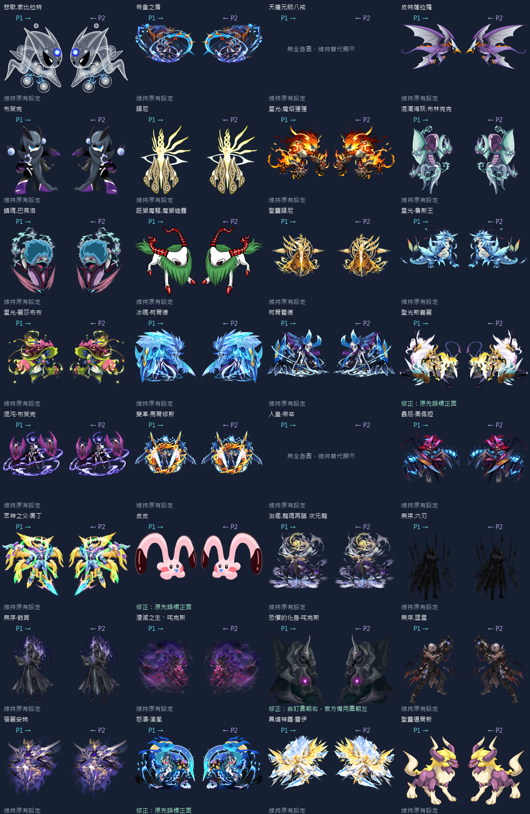
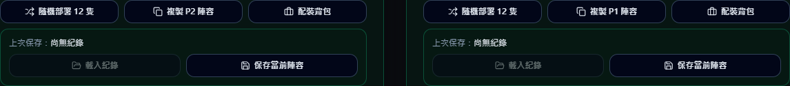
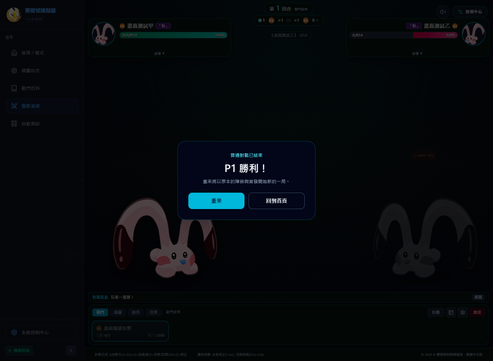

# 精靈立繪朝向盤點與普通對戰介面修正（2026-10-02）

> 此為第一輪盤點紀錄。立繪朝向、八戒／帝辛素材與未知精靈顯示已依使用者目視結果更新，請以 [立繪復驗與動態素材評估](立繪復驗與動態素材評估_20261002.md) 為準；下表保留首輪判讀供追溯。

盤點範圍：32 隻內建精靈，逐圖查看本機立繪與備用素材。30 隻有可用全身圖；天蓬元帥八戒、人皇·帝辛無可用全身圖，保留頭像／文字替代，不將頭像當側身立繪翻轉。正面指主體沒有明確左右朝向，保留原圖。使用者自行指定的未知圖片保留原向。

確認修正：皮皮、聖光斯嘉麗、怒濤·滄嵐的原生圖朝左，P1 應翻轉；恐懼的化身·咤克斯的自訂圖朝右，P2 應翻轉。圖片載入失敗時依備用素材重新判定，避免混沌·布萊克的正面圖退回朝左的布萊克圖時出錯。

| 精靈 | 本機主立繪 | 原生朝向 | P1 | P2 | 結果 |
|---|---|---|---|---|---|
| 悲歌.索比拉特 | /seer/body/343.png | 左 | 鏡射 | 保留 | 維持 |
| 帝皇之盾 | /seer/body/3404.png | 左 | 鏡射 | 保留 | 維持 |
| 天蓬元帥八戒 | 無全身圖 | 未判定 | 保留 | 保留 | 維持 |
| 皮特薩拉羅 | /seer/body/3098.png | 左 | 鏡射 | 保留 | 維持 |
| 布萊克 | /seer/body/875.png | 左 | 鏡射 | 保留 | 維持 |
| 譜尼 | /seer/body/300.png | 正面 | 保留 | 保留 | 維持 |
| 星光·魔焰猩猩 | /seer/body/4649.png | 左 | 鏡射 | 保留 | 維持 |
| 混濁海妖.布林克克 | /seer/body/359.png | 左 | 鏡射 | 保留 | 維持 |
| 鎮魂.巴弗洛 | /seer/body/177.png | 左 | 鏡射 | 保留 | 維持 |
| 誑獅魔軀.魔獅迪露 | /seer/body/187.png | 左 | 鏡射 | 保留 | 維持 |
| 聖靈譜尼 | /seer/body/5000.png | 左 | 鏡射 | 保留 | 維持 |
| 星光·魯斯王 | /seer/body/4648.png | 左 | 鏡射 | 保留 | 維持 |
| 星光·麗莎布布 | /seer/body/4647.png | 左 | 鏡射 | 保留 | 維持 |
| 冰魄·柯爾德 | /seer/body/3886.png | 左 | 鏡射 | 保留 | 維持 |
| 柯爾霍德 | /seer/body/3432.png | 左 | 鏡射 | 保留 | 維持 |
| 聖光斯嘉麗 | /seer/body/3456.png | 左 | 鏡射 | 保留 | 修正：原先誤標正面 |
| 混沌·布萊克 | /seer/body/3539.png | 正面 | 保留 | 保留 | 維持 |
| 變革·馬爾修斯 | /seer/body/3393.png | 正面 | 保留 | 保留 | 維持 |
| 人皇·帝辛 | 無全身圖 | 未判定 | 保留 | 保留 | 維持 |
| 蟲后·奧佩婭 | /seer/body/3626.png | 左 | 鏡射 | 保留 | 維持 |
| 眾神之父·奧丁 | /seer/body/2647.png | 左 | 鏡射 | 保留 | 維持 |
| 皮皮 | /seer/body/10.png | 左 | 鏡射 | 保留 | 修正：原先誤標正面 |
| 治癒.龍魂再臨 次元龍 | /seer/body/4586.png | 正面 | 保留 | 保留 | 維持 |
| 無序.六刃 | /elf-art/wuxu_liuren_body.png | 正面 | 保留 | 保留 | 維持 |
| 無序·蝕言 | /elf-art/wuxu_shiyan_body.png | 正面 | 保留 | 保留 | 維持 |
| 湮滅之主・咤克斯 | /seer/body/4762.png | 左 | 鏡射 | 保留 | 維持 |
| 恐懼的化身·咤克斯 | /elf-art/zhakesi_fear_body.png | 右 | 保留 | 鏡射 | 修正：自訂圖朝右，官方備用圖朝左 |
| 無序.墜星 | /elf-art/wuxu_zhuixing_body.png | 左 | 鏡射 | 保留 | 維持 |
| 蓓麗安特 | /seer/body/4643.png | 正面 | 保留 | 保留 | 維持 |
| 怒濤·滄嵐 | /seer/body/3740.png | 左 | 鏡射 | 保留 | 修正：原先誤標正面 |
| 異境神霆·雷伊 | /elf-art/otherworld_thunder_rey_body.png | 左 | 鏡射 | 保留 | 維持 |
| 聖靈邁爾斯 | /seer/body/1204.png | 左 | 鏡射 | 保留 | 維持 |

## 普通對戰與首頁操作

- 普通對戰分出勝負或平手時顯示結束彈窗，提供「重來」「回到首頁」。重來仍使用原始陣容、配裝與首發，回合、HP、PP 重新初始化。
- 命運與星際探索繼續使用原有結算路徑，避免普通對戰的重來按鈕干擾探索進度。
- P1／P2 下方使用同一套工具列：隨機部署 12 隻、複製對方陣容、配裝背包、保存當前陣容、載入紀錄。
- 各側獨立保存。複製及載入保留隊員技能、學習力、刻印與首發順序，建立新的戰鬥實例。側別的套裝、目鏡、稱號仍由各側自己的配置控制；「複製陣容」複製隊員，對調雙方配置可使用既有對調功能。

## 驗證

- 立繪方向單元測試，涵蓋名稱標點／咤吒別名及自訂圖失敗後的官方圖。
- 真實元件測試：普通對戰勝利彈窗、兩個按鈕、重新初始化、不重複結算、探索模式隔離、雙向複製、保存／載入、刻印／學習力與首發順序。

- 全部回歸測試、型別檢查、正式打包、首頁載入大小檢查通過。
- 實際 Edge 瀏覽器：確認工具列、勝利彈窗、重來再戰及回首頁，無頁面錯誤。畫面驗證使用隔離的測試瀏覽器與測試陣容，未寫入使用者的陣容紀錄。

## 「重來」殘留事件驗收

使用與首頁相同的戰鬥 key 重建流程，在 StrictMode 下實際點擊結束彈窗的「重來」。先完成兩回合及一次換人，確認體力受損與 PP 已消耗，再注入場上／場下殘留狀態；重來後整份戰鬥快照與新局基準完全相同。

已確認重新初始化：雙方全隊 HP／上限、PP／上限／符文、能力等級、異常與期限、護盾／屏障、效果／印記、計時器、精靈個別與雙方註冊表、首發／換人索引、回合、勝負、選擇指令、戰鬥日誌、傷害統計、場地、動畫與彈字。原始陣容未被戰鬥修改。裝備與魂印本身合法的開局效果會重新生成，驗收以全新的同配置戰鬥為基準。

另外驗收動畫尚未完成就卸載的情況：舊局不能再發送結果回呼，也不能影響新局。已新增本局存活檢查、卸載時清空效果佇列與排程回呼；動畫等待結束後的舊程式續段也不再寫入狀態或結算結果。
